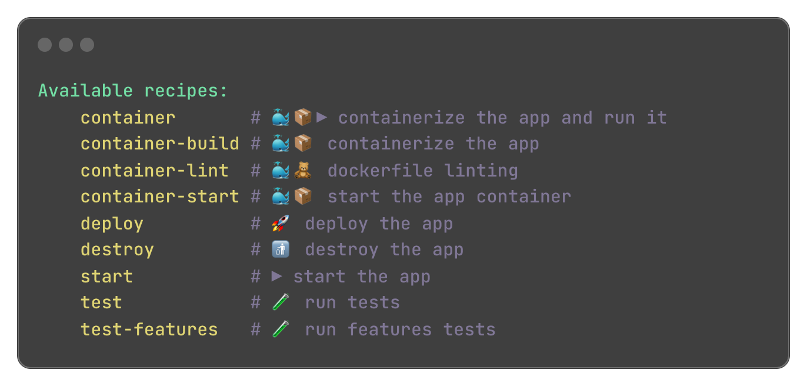

# Lovely Stay - Transaction Script

A simple application that allows users to book a stay in a hotel.

Separates the business logic from the infrastructure code. The business logic is implemented in a transaction script.

## Getting Started

```shell
just -l
```

